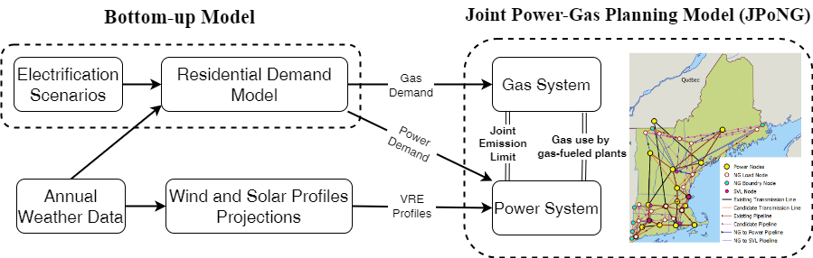
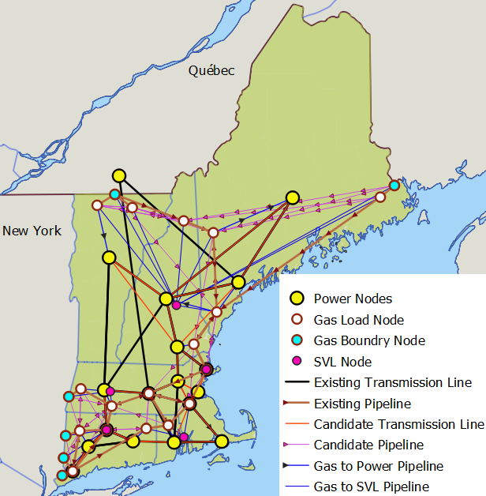

# Dataset for the sustainable energy transition under heating electrification (DASETH)

***Dataset for the sustainable energy transition under heating electrification (DASETH) provides a comprehensive data repository  that enables the modeling of power-gas system futures under deep heating electrification. The dataset considers 6, 17 and 67 subregions in New England and contains:***

1. Hourly projection of power demand and natural demand for the year 2050 under 20 different weather years and 5 different heating electrification levels (100 projections), as shown in Fig. 1
2. Hourly projection of availability factors for solar, wind, and offshore wind generators for the year 2050 under 20 different weather years and 5 different heating electrification levels (100 projections) 
3. Detailed topological description of the current and future power and natural gas infrastructure in the region load zones, transmission lines and pipelines, as depicted in Fig. 2
4. Other parameters for energy planning include parameters for possible power plants and storage technologies. 

The detailed description of constructing each dataset is provided in the ***following paper.***


[Cost-effective Planning of Decarbonized Power-Gas Infrastructure to Meet the Challenges of Heating Electrification](https://arxiv.org/abs/2308.16814)
 
<be>
<br>
  
<p align="center">
  
</p>

***Fig. 1: Three-step procedure to project load data across 20 weather years and 5 electrification scenarios***

<be>
<br>
<p align="center">
  
</p>

***Fig. 2: Topology of power and NG infrastructure in New England. The topology includes the existing infrastructure and possible future developments.***


<be>
<br>
<br>
  
## Overview of the Dataset and Files

The dataset is constructed for New England regions with varying spatial granularity for the power network. The residential load, however, is available for the power system with 17 nodes and is accessible in the folder `Raw_Residential_Data`. 

Insider each of the remaining folders (i.e., `6_Power_Nodes`, `17_Power_Nodes`, and  `67_Power_Nodes`) there are two folders:

 ***1. `Gas_System_Data` contains all the data relevant to the natural gas (NG) system in the region. The gas network remains a 23-node network for all granularity of the power network.***
 
- `Gas_System_Data` that contains all the data relevant to the natural gas (NG) system in the region. The gas network remains a 23-node network for all granularity of the power network.
- `NG_AdjE_Nodes.csv`: adjacent power nodes for each gas node.
- `NG_Load_{Elec_Scenario}_BaseYear{WY}.csv`: these files contain the daily demand of gas across. The {Elec_Scenario} keyword takes one of the 5 electrification scenarios (HE, HX, ME, MX, RF), and {WY} takes one of the 20 weather years between 2001 and 2020.
- 'NG_Nodes.csv': relevant information for each gas node including their locations and associated counties.
- `NG2NG_Pipelines.csv`: existing and candidate pipelines in the gas network.
- `SVL_data.csv`: information for each gas storage-vaporization-liquefaction (SVL) node including their locations and associated counties.
- `SVL_params.csv`: parameters for SVL nodes.
 
 
 ***2. `Power_System_Data` contains all the data relevant to the electric power system in the region.***
 
 - `AvailabilityFactor_{VRE}_BaseYear{WY}.csv`: These files contain the hourly availability factors for renewable generators. The keyword {VRE} takes `Solar`, `Wind_Offshore`, and `Wind_Onshore` values and {WY} takes one of the 20 weather years between 2001 and 2020.
 - `Electricity_Load_{Elec_Scenario}_BaseYear{WY}.csv`: these files contain the hourly demand of electric power. The {Elec_Scenario} keyword takes one of the 5 electrification scenarios (HE, HX, ME, MX, RF) and {WY} takes one of the 20 weather years between 2001 and 2020.
 - `Plant_params.csv`: parameters for the existing and possible future power generators.
 - `Plants_Nodes`: The number of existing power generators in each power node.
 - `Power_Nodes.csv`: information for each electric power node including their locations and the associated counties.
 - `Regional_multipliers.csv`: the relative cost of establishing renewable generators in each state.
 - `Storage_params.csv`: parameters for battery storage technologies.
 - `Transmission_Lines.csv.`: existing and candidate transmission lines.  

 

## Known Usage
So far, the dataset has the known usage in the following papers:

- [Cost-effective Planning of Decarbonized Power-Gas Infrastructure to Meet the Challenges of Heating Electrification](https://arxiv.org/abs/2308.16814)
- [Electric-Gas Infrastructure Planning for Deep Decarbonization of Energy Systems](https://arxiv.org/abs/2212.13655)
- [Decarbonized Future Power-Gas Systems under Large-Scale Electrification of Building Heating](https://ui.adsabs.harvard.edu/abs/2022AGUFMGC42Q0922K/abstract)
- [Learning Spatio-Temporal Aggregations for Large-Scale Capacity Expansion Problems](https://dl.acm.org/doi/abs/10.1145/3576841.3585920)
- [Graph Representation Learning for Energy Demand Data: Application to Joint Energy System Planning under EmissionsConstraints](https://www.climatechange.ai/papers/aaaifss2022/18) 

## Contributors 
***[Rahman Khorramfar (khorram@mit.edu)](https://github.com/RahmanKhorramfar91)***, Postdoctoral Associate at MIT Energy Initiative and Laboratory for Information & Decision Systems, MIT

***[Morgan Santoni-Colvin (msantoni@mit.edu)](https://www.linkedin.com/in/morgan-santoni-colvin/)***, Masters Student in Technology and Policy Program and MIT Energy Initiative, MIT


## Dataset Extension
The dataset is currently curated for the New England region. However, the group is working to extend the dataset to a much wider range of states across the Midwest and Mid-Atlantic regions, enabling policy-relevant analyses by stakeholders across broad swathes of the country.
Please reach out to the contributors for any suggestions, possible collaborations, and ideas for extension of the dataset.

## Important Note
This is the first release of this dataset.  Although the dataset is validated by the contributors, it may contain inconsistencies, typos, and errors. If that is the case, please let the contributors know. 


## Citation
Please cite the following paper when using this dataset:
```bash 
@article{khorramfar2023cost,
  title={Cost-effective Planning of Decarbonized Power-Gas Infrastructure to Meet the Challenges of Heating Electrification},
  author={Khorramfar, Rahman and Santoni-Colvin, Morgan and Amin, Saurabh and Norford, Leslie K and Botterud, Audun and Mallapragada, Dharik},
  journal={arXiv preprint arXiv:2308.16814},
  year={2023}
}
```
